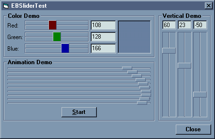

## EBSlider

### Description

The EBSlider control is a self-contained, horizontal/vertical slider control written entirely in VB6.
 
### More Info
 

             |
---                |---
**Submitted On**   |2001-06-20 16:43:06
**By**             |[Richard@Home](https://github.com/Planet-Source-Code/PSCIndex/blob/master/ByAuthor/richard-home.md)
**Level**          |Intermediate
**User Rating**    |4.4 (31 globes from 7 users)
**Compatibility**  |VB 6\.0
**Category**       |[Custom Controls/ Forms/  Menus](https://github.com/Planet-Source-Code/PSCIndex/blob/master/ByCategory/custom-controls-forms-menus__1-4.md)
**World**          |[Visual Basic](https://github.com/Planet-Source-Code/PSCIndex/blob/master/ByWorld/visual-basic.md)
**Archive File**   |[EBSlider214126202001\.zip](https://github.com/Planet-Source-Code/richard-home-ebslider__1-24253/archive/master.zip)

